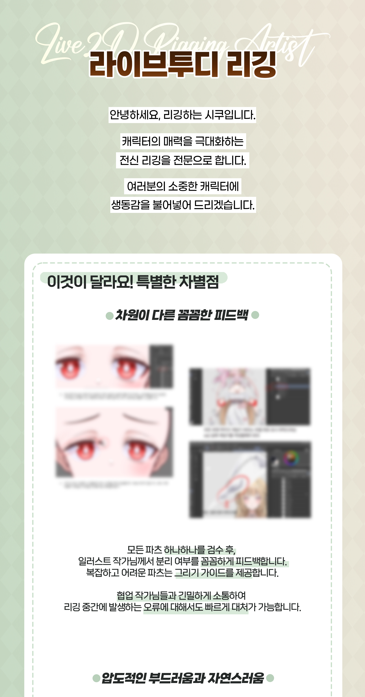
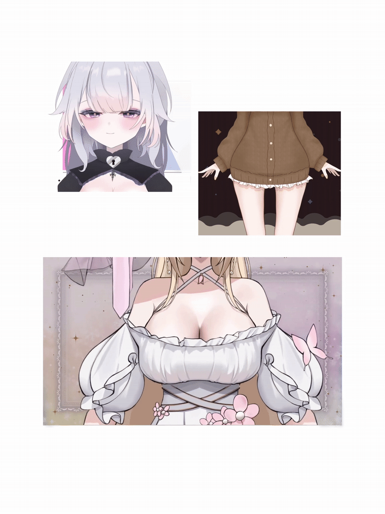
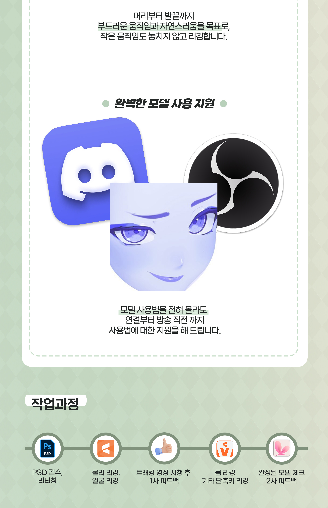

    

        

            협업 작가님
        

    

    

        

            

                
            

            

                <h3 style="margin: 0 0 12px 0; font-size: 24px; color: #333; font-weight: 800; line-height: 1.2;">Maakusu님</h3>
                

                    동시 결제 시 일러스트, 리깅 
                    각각 5만원 할인
                

                <a href="https://artmug.kr/index.php?channel=view&uid=30261" target="_blank" style="display: block; width: 100%; text-align: center; text-decoration: none; background-color: #7a8e73; color: #ffffff; padding: 12px 0; border-radius: 10px; font-size: 14px; font-weight: bold; margin-top: 15px;">작가 페이지 바로가기</a>
            

        

        

            

                
            

            

                <h3 style="margin: 0 0 12px 0; font-size: 24px; color: #333; font-weight: 800; line-height: 1.2;">비호님</h3>
                

                    동시 결제 시 일러스트, 리깅 
                    각각 5만원 할인
                

                <a href="https://artmug.kr/index.php?channel=view&uid=22976" target="_blank" style="display: block; width: 100%; text-align: center; text-decoration: none; background-color: #7a8e73; color: #ffffff; padding: 12px 0; border-radius: 10px; font-size: 14px; font-weight: bold; margin-top: 15px;">작가 페이지 바로가기</a>
            

        

        

            

                
            

            

                <h3 style="margin: 0 0 12px 0; font-size: 24px; color: #333; font-weight: 800; line-height: 1.2;">달먕님</h3>
                

                    동시 결제 시 5만원 할인 
                    + 단축키(표정) 3종 무료
                

                <a href="https://artmug.kr/index.php?channel=view&uid=45788" target="_blank" style="display: block; width: 100%; text-align: center; text-decoration: none; background-color: #7a8e73; color: #ffffff; padding: 12px 0; border-radius: 10px; font-size: 14px; font-weight: bold; margin-top: 15px;">작가 페이지 바로가기</a>
            

        

        

            

                
            

            

                <h3 style="margin: 0 0 12px 0; font-size: 24px; color: #333; font-weight: 800; line-height: 1.2;">YOru님</h3>
                

                    동시 결제 시 일러스트, 리깅 
                    각각 5만원 할인
                

                <a href="https://artmug.kr/index.php?channel=view&uid=52570" target="_blank" style="display: block; width: 100%; text-align: center; text-decoration: none; background-color: #7a8e73; color: #ffffff; padding: 12px 0; border-radius: 10px; font-size: 14px; font-weight: bold; margin-top: 15px;">작가 페이지 바로가기</a>
            

        

    

    

        <iframe style="position: absolute; top: 0; left: 0; width: 100%; height: 100%;" src="https://www.youtube.com/embed/ZPHef7z3De4" frameborder="0" allowfullscreen></iframe>
    

    

        <iframe style="position: absolute; top: 0; left: 0; width: 100%; height: 100%;" src="https://www.youtube.com/embed/_3k0QVG3mOQ" frameborder="0" allowfullscreen></iframe>
    

    

        <iframe style="position: absolute; top: 0; left: 0; width: 100%; height: 100%;" src="https://www.youtube.com/embed/z6T5Cxl973M" frameborder="0" allowfullscreen></iframe>
    

    

        <iframe style="position: absolute; top: 0; left: 0; width: 100%; height: 100%;" src="https://www.youtube.com/embed/9HknF5zeSy4" frameborder="0" allowfullscreen></iframe>
    

    

        <h1 style="font-size: 24px; border-bottom: 2px solid #cddcc7; padding-bottom: 10px; margin-bottom: 5px; color: #353c3a;">리깅 견적 신청 양식</h1>
        
항목을 선택하시면 할인 및 할증이 적용된 최종 금액이 계산됩니다.

        

            

                

                    
리깅 항목 선택

                    

                        <label style="display: flex; justify-content: space-between; cursor: pointer;">
                            <input type="radio" name="rigging-type" value="350000" onchange="calculateTotal()"> 반신
                            350,000원
                        </label>
                        <label style="display: flex; justify-content: space-between; cursor: pointer;">
                            <input type="radio" name="rigging-type" value="500000" onchange="calculateTotal()"> 전신
                            500,000원
                        </label>
                        

                        <label style="display: flex; justify-content: space-between; cursor: pointer;">
                            <input type="checkbox" class="extra-option" value="100000" onchange="calculateTotal()"> 얼굴 가동력 증가
                            +100,000원
                        </label>
                        <label style="display: flex; justify-content: space-between; cursor: pointer;">
                            <input type="checkbox" class="extra-option" value="100000" onchange="calculateTotal()"> 몸 가동력 증가
                            +100,000원
                        </label>
                    

                

                

                    
단축키 (중복 선택 가능)

                    

                        <label style="display: flex; justify-content: space-between; cursor: pointer;"><input type="checkbox" class="extra-option" value="10000" onchange="calculateTotal()"> 홍조10,000원</label>
                        <label style="display: flex; justify-content: space-between; cursor: pointer;"><input type="checkbox" class="extra-option" value="10000" onchange="calculateTotal()"> 하트 눈10,000원</label>
                        <label style="display: flex; justify-content: space-between; cursor: pointer;"><input type="checkbox" class="extra-option" value="10000" onchange="calculateTotal()"> 별 눈10,000원</label>
                        <label style="display: flex; justify-content: space-between; cursor: pointer;"><input type="checkbox" class="extra-option" value="10000" onchange="calculateTotal()"> 볼빵빵10,000원</label>
                        <label style="display: flex; justify-content: space-between; cursor: pointer;"><input type="checkbox" class="extra-option" value="50000" onchange="calculateTotal()"> 10초 반복 애니50,000원</label>
                        <label style="display: flex; justify-content: space-between; cursor: pointer;"><input type="checkbox" class="extra-option" value="80000" onchange="calculateTotal()"> 심화 애니80,000원</label>
                        <label style="display: flex; justify-content: space-between; cursor: pointer;"><input type="checkbox" class="extra-option" value="80000" onchange="calculateTotal()"> 게임기 양손80,000원</label>
                        <label style="display: flex; justify-content: space-between; cursor: pointer;"><input type="checkbox" class="extra-option" value="40000" onchange="calculateTotal()"> 마이크 한 손40,000원</label>
                        <label style="display: flex; justify-content: space-between; cursor: pointer;"><input type="checkbox" class="extra-option" value="100000" onchange="calculateTotal()"> Vbridger100,000원</label>
                    

                

            

            

                

                    
모델 설명 및 추가 단축키

                    <input type="text" id="desc-input" placeholder="상세 내용 입력" style="width: 100%; padding: 8px; border: 1px solid #b5c4b0; border-radius: 8px; box-sizing: border-box; outline: none;">
                

                

                    
협업작가 (-50,000원 할인)

                    

                        <label><input type="radio" name="collab" value="0" checked onchange="calculateTotal()"> 해당없음</label>
                        <label><input type="radio" name="collab" value="-50000" onchange="calculateTotal()"> Maakusu</label>
                        <label><input type="radio" name="collab" value="-50000" onchange="calculateTotal()"> 비호</label>
                        <label><input type="radio" name="collab" value="-50000" onchange="calculateTotal()"> 달먕</label>
                        <label><input type="radio" name="collab" value="-50000" onchange="calculateTotal()"> YOru</label>
                    

                

                

                    
기타 선택사항

                    

                        <label style="cursor: pointer;"><input type="radio" name="broadcast" checked> 리깅 방송 송출 가능</label>
                        <label style="cursor: pointer;"><input type="radio" name="broadcast"> 리깅 방송 송출 불가능</label>
                        

                        <label style="display: flex; justify-content: space-between; cursor: pointer;">
                            <input type="radio" name="portfolio" value="1" checked onchange="calculateTotal()"> 포트폴리오 공개
                        </label>
                        <label style="display: flex; justify-content: space-between; cursor: pointer;">
                            <input type="radio" name="portfolio" value="1.35" onchange="calculateTotal()"> 포트폴리오 비공개
                            +35%
                        </label>
                        <label style="display: flex; justify-content: space-between; cursor: pointer;">
                            <input type="radio" name="portfolio" value="1.5" onchange="calculateTotal()"> 포트폴리오 영구 비공개
                            +50%
                        </label>
                        

                        <label style="display: flex; justify-content: space-between; cursor: pointer;">
                            <input type="checkbox" id="commercial-use" onchange="calculateTotal()"> <strong>상업용</strong>
                            최종금액 x 3
                        </label>
                    

                

                

                    
그 밖의 당부의 말

                    <textarea id="extra-notes" rows="3" placeholder="요청사항 입력" style="width: 100%; padding: 8px; border: 1px solid #b5c4b0; border-radius: 8px; box-sizing: border-box; outline: none; resize: vertical;"></textarea>
                

                

                    
기본 합계: 0원

                    
최종 가격: 0원

                

                <button onclick="copyForm()" style="width: 100%; padding: 15px; background-color: #7a8e73; border: none; border-radius: 10px; font-weight: bold; cursor: pointer; font-size: 16px; color: #fff;">견적서 복사하기</button>
            

        

    

